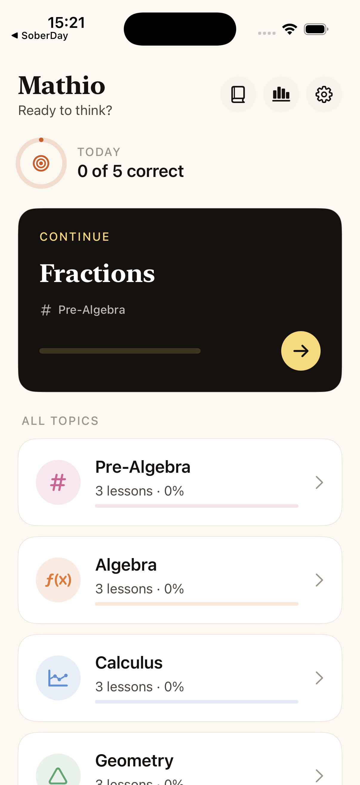

# Mathio

A premium math practice app for iOS. Algebra to calculus, one small step a day.



**Mathio** is a calm, editorial-feeling math trainer in the spirit of *Math Zen* and *Brilliant*, intentionally simpler:

- **No leaderboards.** Personal daily streak instead — builds motivation without social pressure.
- **No LaTeX keyboard.** Type plain text (`6x+2`, `sqrt(2)`, `pi`); a smart parser handles the rest.
- **Step-by-step solutions** appear inline whenever you get a question wrong — never just "Not quite."
- **Adaptive next-up** chooses the lesson with the lowest mastery, gated by your subscription tier.
- **Spaced repetition** surfaces overdue questions in a daily Review queue (Leitner-box intervals).

Native iOS 18+, SwiftUI, **StoreKit 2** (no third-party SDKs), DE + EN localized.

## Features

| | |
|---|---|
| **Topics** | Pre-Algebra · Algebra · Calculus · Geometry · Trigonometry |
| **Lessons** | 14 lessons, ~70 questions across multiple-choice, free-answer, true/false |
| **Review queue** | Spaced repetition based on Leitner intervals (1d / 3d / 1w / 2w / 1m) |
| **Daily goal** | User-set target (default 5 correct/day), settable in Settings |
| **Streak + freeze** | Daily streak with auto-spent freezes (1 weekly refill, max 2) |
| **Bookmarks** | Save formulas to a bilingual reference page |
| **Push reminder** | Optional daily reminder at 19:00 |
| **Dark mode** | Full semantic color palette adapts to system / light / dark |
| **Accessibility** | VoiceOver labels on all interactive elements + math spoken-form |

## Subscription model

Native StoreKit 2 in-app subscriptions — no RevenueCat, no third-party SDKs.

| Plan | Price | Trial | Notes |
|---|---|---|---|
| **Annual** | $59.99 / year | 7-day free trial | Family Sharing enabled, anchored as “$1.15/week" |
| **Weekly** | $12.99 / week | 3-day free trial | Hook tier for impulse converts |
| **Retention** | $44.99 / year | — | Shown only when user taps Cancel; 25% off the annual |

App Store guideline 3.1.2 compliant: billed amount prominent, inline auto-renewal disclaimer, visible Privacy & Terms links.

## Local development

Requires macOS 26 + Xcode 26.3+, targets iOS 18.

```bash
# Open the project
open iOS/Mathio/Mathio.xcodeproj

# Build from CLI
cd iOS/Mathio
xcodebuild -scheme Mathio \
  -destination 'platform=iOS Simulator,name=iPhone 17,OS=latest' \
  -configuration Debug build CODE_SIGNING_ALLOWED=NO
```

The scheme references `Mathio/Mathio.storekit` so subscription purchases work locally without an internet connection. No API keys required.

## Architecture

```
Mathio/
├── MathioApp.swift          @main, instantiates Store / PremiumStore / UserSettings
├── Models.swift             Topic / Lesson / Question + Store, AnsweredEntry, UserSettings
├── Content.swift            Curriculum (5 topics, 14 lessons, ~70 questions)
├── DesignSystem.swift       Palette (semantic dark/light), typography, MathText, components
├── MathExpression.swift     Forgiving answer normalizer (handles π/√, en-dash minus, DE comma)
├── ContentView.swift        All views: Onboarding → Home → Topic → Lesson → Practice
│                            → Review → Stats → Settings → Formula Reference → Paywall
├── Mathio.storekit          Local sub config (3 products + intro offers)
├── Localizable.xcstrings    EN + DE
└── Assets.xcassets          AppIcon (1024x1024), AccentColor
```

## Data persistence

Everything is stored in `UserDefaults`. No server, no cloud sync, no analytics SDK. Designed to be auditable for App Privacy declarations: nothing leaves the device except StoreKit purchase events (handled by Apple).

| Key | What |
|---|---|
| `mathio.answered.v2` | `[QuestionID: AnsweredEntry]` — attempts, correct, lastAt, lastCorrect, streakCorrect |
| `mathio.streak.count` / `.last` | Day streak + last-active date |
| `mathio.streak.freezes` / `.freezeRefillDate` | Streak freezes inventory + weekly refill timestamp |
| `mathio.dailyGoal` | User-set goal (1–30 correct/day) |
| `mathio.notifications.enabled` | Daily reminder toggle |
| `mathio.theme` | system / light / dark |
| `mathio.bookmarks` | `[FormulaKey]` — saved formulas |
| `mathio.onboarded` | Has seen onboarding |

## Roadmap

- [ ] Lock Screen + Home widget (streak + today's ring)
- [ ] App Intent: "Hey Siri, practice math"
- [ ] FSRS algorithm (currently Leitner; FSRS reduces reviews ~25%)
- [ ] Calendar heatmap on stats
- [ ] Weekly recap card
- [ ] Topic expansion: Statistics, Linear Algebra
- [ ] Real-domain hosted Privacy / Terms pages

## License

MIT — see [LICENSE](LICENSE).
